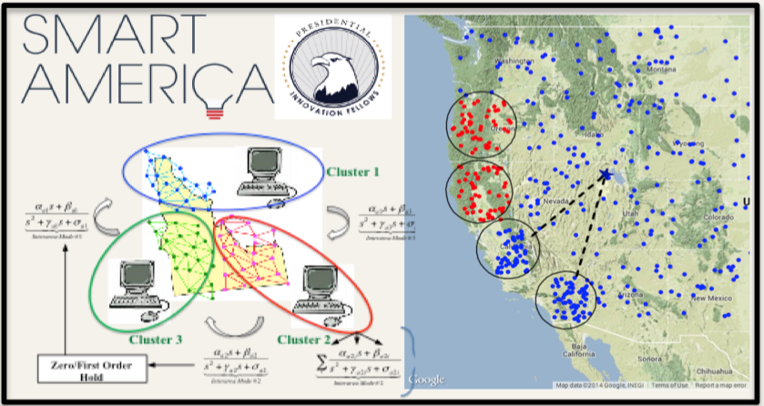
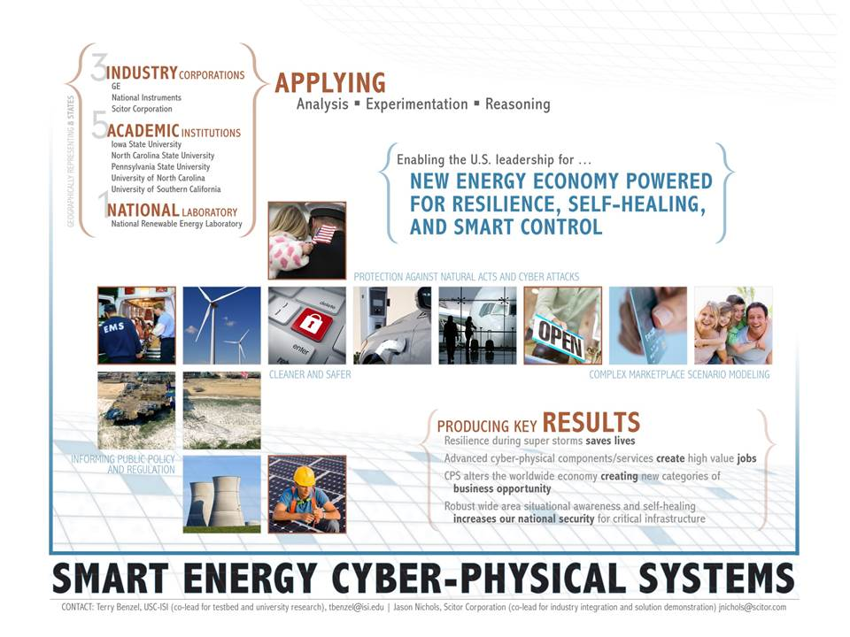

Attack Resilient Wide Area Monitoring of Power Systems
------------------------------------------------------

In this project, 
we demonstrated a real-time distributed optimization algorithm 
based on Alternating Directions Method of Multipliers (ADMM) for estimating the electro-mechanical oscillation modes of large power system networks using *Synchrophasors*.
We partitioned the 
network topology to be divided into multiple clusters, with each cluster equipped with a local estimator at the local control center. 
The local estimators receive  Synchrophasor measurements from within their own respective areas, run a local consensus algorithm, and communicate their estimates to an estimator. 
We illustrated  our results using a hardware-in-loop power system emulation testbed at NC State federated with `DETERLab <http://www.deter-project.org>`_.

As part of the SmartAmerica exposition, 
we implemented and demonstrated the resiliency of the proposed algorithm. 
We first showed that in the current state-of-art (`Case I <http://tau.isi.edu/magi-viz/smartamerica/CA>`_ ),
the error in the estimation is high in the presence of the attack.
We then showed that in the next-generation algorithms proposed and implemented by our team (`Case II <http://tau.isi.edu/magi-viz/smartamerica/DA>`_ ), 
the error in the estimation stays low even in the presence of the attack. 

The Demonstrations are available as: 
 * `Case I: A Centralized Estimator with high error during cyber attacks <http://tau.isi.edu/magi-viz/smartamerica/CA>`_
 * `Case II: A Distributed Estimator resilient to cyber attacks <http://tau.isi.edu/magi-viz/smartamerica/DA>`_ 

Addtional information on the above scenarios is available as: 
 * Alefiya Hussain and Aranya Chakrabortty, "`Design and Anaylsis of Wide-Area Resilient Control Algorithms for Large-Scale Power Systems: Theoretical and Experimental Methods <http://www.isi.edu/~hussain/publications/SmartAmerica14b.pdf>`_". Poster presented at the SmartAmerica Exposition, June 2014, Washington DC 
 * Jianhua Zhang, Prateek Jaipuria, Aranya Chakrabortty, and Alefiya Hussain, "`Distributed Optimization Algorithms for Attack-Resilient Wide-Area Monitoring of Power Systems: Theoretical and Experimental Methods <http://www.isi.edu/~hussain/publications/Zhang14a.pdf>`_", In the proceedings of GameSec Conference, November 2014, Marina Del Rey, CA. 

SMARTAMERICA Exposition 
-------------------------

The `SmartAmerica Challenge <http://www.smartamerica.org>`_  was a White House Presidential Innovation Fellow project to bring together research in Cyber-Physical Systems (CPS) and test-beds from different sectors. 
On June 11 2014, our team demonstrated SmartEnergy algorithms and technologies 
using the DHS-funded DETERLab facilities at the Washington DC Convention Center. Our team was comprised of 
Iowa State University, MITRE Corporation, National Instrument, NREL
North Carolina State University, Penn State University, Scitor Corporation,
University of North Carolina, Chapel Hill, and the University of Southern California, Information Sciences Institute

In the challenge, the term "cyber-physical system" indicated a combination of the physical entities that were 
controlled dynamically to improve security and resiliency of the SmartGrid. Using the DETERLab technologies, such at `MAGI <http://montage.deterlab.net/magi>`_ and `Federation <http://fedd.deterlab.net>`_, 
we demonstatrated next generation distributed wide area oscillation 
monitoring algorithms that are significantly more robust to cyber attacks and super storm disruptions. 

Our Team and Goals 
--------------------

Our world is changing how energy is produced, distributed and consumed. We have the opportunity to determine our nation’s role in this transformation.  
Our team, comprised of five leading universities, one national lab and three industrial corporations, headquartered in eight states, will demonstrate a set of synergistic scenarios that must fuel ongoing analysis, research and development to inform policy makers and researchers in order to ensure that our country will achieve the benefits of an Industrial Internet.

Benefit of the project includes: First, we provide extensible research testbeds integrated across four leading universities providing research infrastructure for fundamental research and national-level grid exercises. These capabilities aimed at combatting a new generation of advanced persistent threats, cyber-attack actors and advanced nation state adversaries, advance our homeland security preparedness. Second, US-manufactured smart sensor technologies enable wide area and distributed monitoring, yielding regional and national-scale resilience to large scale disruptions such as super storms. Building on initial investments from the ARRA , we demonstrate new technologies, powered with skillsets that create meaningful jobs spanning our national middle class. Third, clean renewable energy generation, complimenting traditional generation assets, combining resurgence in natural gas to expand domestic energy generation. Our utilities, regulators, economists and other policy stakeholders need insight into the ideal and balanced mix of generation and transmission assets. Our introduction of serious gaming platforms models complex interactions and provides critical feedback for future policies that improve our economy, reduce carbon emissions and create new marketplace business opportunity.

 

